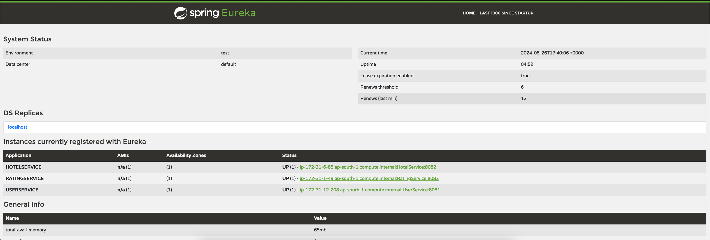

Hotels Ratings Managements

This portfolio project demonstrates a microservices architecture with three core services, a service discovery mechanism, a centralized configuration server, and an API gateway. The project is built to manage user data, hotel information, and user ratings for hotels, while also providing robust service discovery and API management.
Project Overview
1. User Service

The User Service is responsible for managing user data and tracking essential user information. It allows for the creation, retrieval, update, and deletion of user profiles. This service manages:

    Basic user information (e.g., name, email)

2. Hotel Service

The Hotel Service handles hotel data management, including details like:

    Hotel name
    Location
    Cuisine information
    Other relevant hotel details

This service supports operations to add, update, retrieve, and delete hotel records.
3. Ratings Service

The Ratings Service tracks the ratings that users give to hotels. It manages the relationships between users and hotels, storing details such as:

    Rating score
    Review comments

This service allows for CRUD operations on ratings data.
4. Service Discovery

A Service Discovery mechanism is implemented to monitor the status of all services. This helps in maintaining the availability of services and enabling communication between them.
5. Config Server

The Config Server is used to manage the configuration of all services centrally. The configurations are stored in a GitHub repository, ensuring that each service can pull its configuration as needed, providing consistency and ease of management.
6. API Gateway

The API Gateway acts as a single entry point into the microservices ecosystem. It routes requests to the appropriate service, handles load balancing, and provides security features such as authentication and rate limiting.
Tech Stack

    Spring Boot: Framework for building microservices
    Java 17: Programming language used for service implementation
    AWS: Cloud platform for hosting the services
    MySQL: Database used for the User Service
    PostgreSQL: Database used for the Hotel Service
    MongoDB: Database used for the Ratings Service
    Spring Cloud: Tools for service discovery and configuration management
    Terraform: Infrastructure as Code (IaC) tool used to provision AWS resources
    Ansible: Configuration management tool used after resource creation
    Packer: Tool used to create the base image for deployment
    AWS EKS: Managed Kubernetes service used for containerization
    GitHub: Version control and configuration storage

    Project Structure
    .
    ├── user-service/
    ├── hotel-service/
    ├── ratings-service/
    ├── service-discovery/
    ├── config-server/
    └── api-gateway/

    user-service/: Contains the code and configuration for the User Service.
    hotel-service/: Contains the code and configuration for the Hotel Service.
    ratings-service/: Contains the code and configuration for the Ratings Service.
    service-discovery/: Contains the setup for service discovery.
    config-server/: Contains the setup for the Config Server and connection to the GitHub repository.
    api-gateway/: Contains the setup for the API Gateway.

    Prerequisites
    
    To run this project, you need to have the following installed:
    
        Java 17
        Maven
        Git

    Getting Started

    Clone the Repository:

    bash

    git clone https://github.com/your-username/portfolio-project.git
    cd portfolio-project

    Set Up Configurations: Ensure that your configuration files are correctly set up in the GitHub repository linked with the Config Server.

    Build and Run Services: Build and run the services using your preferred method.

    Access the API Gateway: Once all services are up and running, you can access the API Gateway at http://localhost:8080.

Final Output

AWS Resources

The AWS resources required for this project, including instances, databases, and networking components, have been provisioned using Terraform scripts. Configuration management is handled with Ansible after resource creation, and Packer is used to create the base image for deployment. AWS EKS is employed for containerization, providing a scalable and managed Kubernetes environment.
Contributing

Contributions are welcome! Please fork this repository and submit a pull request.
License

This project is licensed under the MIT License - see the LICENSE file for details.